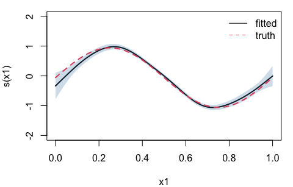

<!-- README.md is generated from README.Rmd. Please edit that file -->

# gamRTMB

<!-- badges: start -->

<!-- badges: end -->

Distributional (GAMLSS-style) regression where smooth terms can enter
**every** parameter of a distribution, not just the mean.

The package is mostly glue, by design:

- **mgcv** builds the bases and penalties, and `mgcv::smooth2random()`
  reparameterises the penalized coefficients as iid Gaussian random
  effects;
- **RTMB** supplies automatic differentiation and the Laplace
  approximation;
- **RTMBdist** supplies the log-densities, each in its own **native**
  parameterisation — a skew normal is modelled as `xi`, `omega`,
  `alpha`, not as generic location/scale/shape.

Restricted maximum likelihood is the default, effective degrees of
freedom per smooth agree with mgcv, and smoothing parameters can be
shared between terms *and* between distributional parameters.

Most of the package was written by Claude Code.

## Installation

``` r
# install.packages("pak")
pak::pak("janolefi/gamRTMB")
```

## Example

A Gaussian location-scale model: the mean varies smoothly with `x1`, and
so does the standard deviation.

``` r
library(gamRTMB)

set.seed(1)
n <- 500
d <- data.frame(x1 = runif(n), x2 = runif(n))
d$y <- rnorm(n, mean = sin(2 * pi * d$x1) + d$x2^2,
             sd = exp(-1 + 0.8 * cos(2 * pi * d$x1)))

fit <- gamRTMB(y ~ list(mean = ~ s(x1) + s(x2), sd = ~ s(x1)), data = d)
fit
#> gamRTMB fit
#>   family:    norm (mean/identity, sd/log)
#>   criterion: REML   engine: laplace
#>   converged: TRUE   -logLik: 258.4182   max|grad|: 9.58e-06
#>   observations: 500
#>   coefficients: 5 fixed (incl. null spaces), 24 penalized; 3 smoothing parameters
```

`summary()` lays this out per distributional parameter — every parameter
has its own formula, link, coefficients and smooths:

``` r
summary(fit)
#> 
#> Family: norm   [dnorm from RTMB]
#> Links:  mean = identity,  sd = log
#> 
#> Formula:
#>   mean ~ s(x1) + s(x2)
#>     sd ~ s(x1)
#> 
#> Parametric coefficients:
#>                  Estimate Std. Error z value Pr(>|z|)    
#> mean:(Intercept)  0.36556    0.02247   16.27   <2e-16 ***
#> sd:(Intercept)   -0.98778    0.03184  -31.02   <2e-16 ***
#> ---
#> Signif. codes:  0 '***' 0.001 '**' 0.01 '*' 0.05 '.' 0.1 ' ' 1
#> 
#> Smooth terms:
#>        term   edf k     sp
#>  mean:s(x1) 7.483 9 0.1192
#>  mean:s(x2) 3.688 9  9.331
#>  sd:s(x1)   5.710 9 0.1814
#> 
#> Total EDF = 18.88   n = 500
#> -REML = 258.418   logLik = -215.580   AIC = 468.92
```

Smooth terms are reported with their effective degrees of freedom and
smoothing parameters, but deliberately without p-values: mgcv’s
“approximate significance” rests on Wood’s test for a term’s whole
coefficient block, and a naive Wald test in its place would mislead.
`edf(fit)` returns that table on its own.

`AIC()` and `BIC()` use the log-likelihood at the fitted coefficients
with the total effective degrees of freedom — the same convention as
mgcv and GAMLSS’s GAIC — not the REML criterion, which is not a
likelihood and is not comparable across mean structures. The criterion
itself stays available as `fit$objective`.

``` r
c(logLik = as.numeric(logLik(fit)), df = attr(logLik(fit), "df"), AIC = AIC(fit))
#>     logLik         df        AIC 
#> -215.57982   18.88077  468.92119
```

Predictions come back as one vector per distributional parameter. New
data is pushed through `mgcv::PredictMat()` on the stored smooths, so
the basis and knots are exactly those of the fit:

``` r
grid <- data.frame(x1 = seq(0, 1, length.out = 5), x2 = 0.5)
predict(fit, newdata = grid, type = "response")
#> $mean
#> [1] -0.07480724  1.23104173  0.25907607 -0.78599712  0.25564047
#> 
#> $sd
#> [1] 0.9104810 0.4027244 0.1655772 0.3676115 0.8616064
```

### Any family

`fam()` derives the parameter names, links and starting values from the
density itself, so nothing has to be hand-written per distribution.
`families()` lists what is available — everything in RTMBdist that is a
univariate regression family, plus the standard densities RTMB makes
AD-aware:

``` r
nrow(families())
#> [1] 87
families("gamma|^norm$|zipois")
#>     family                           parameters needs   source
#> 1    gamma                  shape/log, rate/log           RTMB
#> 2   gamma2                     mean/log, sd/log       RTMBdist
#> 3 gengamma       mu/log, sigma/log, nu/identity       RTMBdist
#> 4 invgamma                  shape/log, rate/log       RTMBdist
#> 5     norm                mean/identity, sd/log           RTMB
#> 6  zigamma shape/log, scale/log, zeroprob/logit       RTMBdist
#> 7 zigamma2     mean/log, sd/log, zeroprob/logit       RTMBdist
#> 8   zipois           lambda/log, zeroprob/logit       RTMBdist
```

Parameter names are always the density’s own, which is why a Gaussian is
`mean`/`sd` rather than `mu`/`sigma`. Here a skew normal, with a smooth
on all three of its parameters at once:

``` r
f <- fam("skewnorm2")
f
#> gamRTMB family: skewnorm2  [dskewnorm2, RTMBdist]
#>   modelled: mean (identity), sd (log), alpha (identity)

set.seed(2)
n <- 1500
d2 <- data.frame(x1 = runif(n), x2 = runif(n), x3 = runif(n))
d2$y <- RTMBdist::rskewnorm2(n,
  mean  = sin(2 * pi * d2$x1),
  sd    = exp(-0.2 + 0.5 * cos(2 * pi * d2$x2)),
  alpha = 2.5 * sin(2 * pi * d2$x3))

fit2 <- gamRTMB(y ~ list(mean = ~ s(x1), sd = ~ s(x2), alpha = ~ s(x3)),
                family = f, data = d2)
edf(fit2)
#>   parameter  term      edf k       sp id
#> 1      mean s(x1) 7.429360 9   0.1494   
#> 2        sd s(x2) 5.522424 9   0.6772   
#> 3     alpha s(x3) 4.317055 9 0.003831
```

Parameters that are known data rather than quantities to model — the
number of binomial trials, truncation bounds — are declared separately
and are not reachable from the formula:

``` r
fam("betabinom", fixed = list(size = "trials"))
#> gamRTMB family: betabinom  [dbetabinom, RTMBdist]
#>   modelled: shape1 (log), shape2 (log)
#>   fixed:    size
```

### Weights, offsets and missing data

Prior weights multiply each observation’s log-density contribution,
exactly as in `glm()`. An `offset()` goes inside the formula of the
parameter it belongs to — per-parameter, because `sd = ~ offset(log(s))`
means something quite different from the same term on `mean`. Missing
values in any model variable are handled by `na.action`, `na.omit` by
default, and the number of dropped rows is reported.

``` r
set.seed(4)
n <- 400
p <- data.frame(x = runif(n), E = runif(n, 1, 5))
p$y <- rpois(n, p$E * exp(sin(2 * pi * p$x)))
p$y[1:3] <- NA

fit_p <- gamRTMB(y ~ list(lambda = ~ s(x) + offset(log(E))),
                 family = fam("pois"), data = p,
                 weights = rep(c(1, 2), n / 2))
fit_p
#> gamRTMB fit
#>   family:    pois (lambda/log)
#>   criterion: REML   engine: laplace
#>   converged: TRUE   -logLik: 1099.6227   max|grad|: 3.33e-06
#>   observations: 397 (3 dropped: missing), prior weights
#>   coefficients: 2 fixed (incl. null spaces), 8 penalized; 1 smoothing parameter
```

### Shared smoothing parameters

`s(..., id = )` ties smooths to one smoothing parameter, exactly as in
mgcv (including the linked bases, so the shared variance means the same
thing for each term). Unlike mgcv, the group may span distributional
parameters:

``` r
fit3 <- gamRTMB(y ~ list(mean = ~ s(x1, id = "sh"),
                         sd   = ~ s(x1, id = "sh")),
                data = d)
fit3
#> gamRTMB fit
#>   family:    norm (mean/identity, sd/log)
#>   criterion: REML   engine: laplace
#>   converged: TRUE   -logLik: 423.9595   max|grad|: 8.13e-08
#>   observations: 500
#>   coefficients: 4 fixed (incl. null spaces), 16 penalized; 2 smoothing parameters (1 free, 1 tied by id)
edf(fit3)
#>   parameter  term      edf k     sp id
#> 1      mean s(x1) 6.585786 9 0.1523 sh
#> 2        sd s(x1) 5.964221 9 0.1523 sh
```

## Confidence bands

Ask for the joint precision matrix at fit time and `predict()` will
return standard errors, per term or for the whole linear predictor:

``` r
# fitb <- gamRTMB(y ~ list(mean = ~ s(x1) + s(x2), sd = ~ s(x1)), data = d)

g <- data.frame(x1 = seq(0, 1, length.out = 200), x2 = 0.5)
tm <- predict(fit, newdata = g, type = "terms", se.fit = TRUE)

par(mar = c(4, 4, 1, 1))
plot(g$x1, tm$mean$fit[, 1], type = "l", lwd = 2, ylim = c(-2, 2),
     xlab = "x1", ylab = "s(x1)", bty = "n")
polygon(c(g$x1, rev(g$x1)),
        c(tm$mean$fit[, 1] + 2 * tm$mean$se[, 1],
          rev(tm$mean$fit[, 1] - 2 * tm$mean$se[, 1])),
        col = adjustcolor("steelblue", 0.25), border = NA)
lines(g$x1, sin(2 * pi * g$x1) - mean(sin(2 * pi * d$x1)),
      col = "firebrick", lty = 3, lwd = 2)
legend("topright", c("fitted", "truth"), col = c(1, "firebrick"), 
       lty = c(1, 3), bty = "n")
```



## Status and scope

Early but checked. EDF and fitted values agree with
`mgcv::gam(family = gaulss())` to three decimals, with and without
shared smoothing parameters, and `predict()` on the fitting data
reproduces the in-sample linear predictors to machine precision.

Supported: `s()`, `t2()`, `by =` variables, `bs = "fs"`, `bs = "re"`,
and `id =`. Not supported: `te()` (mgcv itself declines
`smooth2random(type = 2)` for it — use `t2()`) and `fx = TRUE` (no
penalized part to make random).

An extended Fellner–Schall fitting engine is planned as an alternative
to the Laplace one; `dev/NOTES-fellner-schall.md` records the derivation
and the seams it needs.
