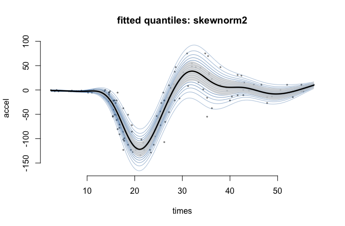

<!-- README.md is generated from README.Rmd. Please edit that file -->

# gamRTMB

<!-- badges: start -->

[](https://github.com/janolefi/gamRTMB/actions/workflows/R-CMD-check.yaml)
<!-- badges: end -->

Distributional (GAMLSS-style) regression where smooth terms can enter
**every** parameter of a distribution, not just the mean.

The package is mostly glue, by design:

- **mgcv** builds the bases and penalties, and `mgcv::smooth2random()`
  reparameterises the penalized coefficients as iid Gaussian random
  effects — except where the penalty is already a sparse precision
  matrix, which keeps it and uses `RTMB::dgmrf()` instead;
- **RTMB** supplies automatic differentiation and the Laplace
  approximation;
- **RTMBdist** supplies the log-densities, each in its own **native**
  parameterisation — a skew normal is modelled as `xi`, `omega`,
  `alpha`, not as generic location/scale/shape.

Restricted maximum likelihood is the default, effective degrees of
freedom per smooth agree with mgcv, and smoothing parameters can be
shared between terms *and* between distributional parameters.

## Installation

``` r
# install.packages("pak")
pak::pak("janolefi/gamRTMB")
```

## Example

`MASS::mcycle` measures head acceleration in a simulated motorcycle
crash. The mean is famously hard to model — and the variance changes
just as much.

``` r
library(gamRTMB)
data(mcycle, package = "MASS")

fit <- gamRTMB(accel ~ list(mean = ~ s(times, k = 15),
                            sd   = ~ s(times, k = 10)),
               data = mcycle, family = fam("skewnorm2"))
summary(fit)
#> 
#> Family: skewnorm2   [dskewnorm2 from RTMBdist]
#> Links:  mean = identity,  sd = log,  alpha = identity
#> 
#> Formula:
#>    mean ~ s(times, k = 15)
#>      sd ~ s(times, k = 10)
#>   alpha ~ 1
#> 
#> Parametric coefficients:
#>                    Estimate Std. Error z value Pr(>|z|)    
#> mean:(Intercept)  -25.10791    1.86401  -13.47   <2e-16 ***
#> sd:(Intercept)      2.62085    0.06629   39.54   <2e-16 ***
#> alpha:(Intercept)  -0.85682    1.33923   -0.64    0.522    
#> ---
#> Signif. codes:  0 '***' 0.001 '**' 0.01 '*' 0.05 '.' 0.1 ' ' 1
#> 
#> Smooth terms:
#>           term    edf  k        sp
#>  mean:s(times) 12.159 14 4.684e-06
#>  sd:s(times)    6.931  9   0.01052
#> 
#> Total EDF = 22.09   n = 133
#> -REML = 586.710   logLik = -537.209   AIC = 1118.60
```

Once every parameter varies, the useful output is covariate-dependent
quantiles rather than a mean and one standard error:

``` r
plot(fit, type = "quantile")
```



Term plots, a worm plot of randomised quantile residuals, and everything
else are in `vignette("gamRTMB")`.

## What it does

|  |  |
|----|----|
| Families | 85, from RTMBdist plus the standard R densities; `families()` lists them, `fam()` builds one |
| Formula | `y ~ list(mean = ~ s(x), sd = ~ s(z))`, one one-sided formula per parameter, missing ones get `~1` |
| Smooths | `s()`, `t2()`, `by=`, `bs="fs"`, `bs="re"`, shrinkage bases, and `id=` to share smoothing parameters |
| Spatial | `bs="mrf"` Markov random fields over an adjacency graph, or any precision matrix via `xt=list(penalty=)`; `bs="spde"` Matern fields on an [fmesher](https://cran.r-project.org/package=fmesher) mesh. Both kept sparse, so a few thousand regions or mesh nodes is routine |
| Criterion | `REML` by default (coefficients integrated out by the same Laplace approximation), `ML`, or `aREML` — the REML criterion optimised by extended Fellner–Schall, which fits four-parameter families the other two cannot start |
| Inference | `summary()`, `vcov()`, `edf()`, `AIC()`/`BIC()`, `predict()` with standard errors |
| Diagnostics | `residuals()` gives randomised quantile residuals; `plot(type = "worm")` |
| Also | `weights`, `offset()` inside a parameter’s formula, `na.action` |

## Status

Early but checked. EDF and fitted values agree with
`mgcv::gam(family = gaulss())` to three decimals, with and without
shared smoothing parameters; `predict()` on the fitting data reproduces
the in-sample linear predictors to machine precision; and quantile
standard errors match both an analytic special case and simulation from
the joint posterior. The sparse GMRF route is a reparameterisation
rather than an approximation, and is checked against the dense one:
log-likelihood, EDF, AIC, fitted values, predictions and their standard
errors all agree, on Markov random fields and on ordinary smooths alike.
The SPDE precision matches the closed form
$\tau^2(\kappa^4 C + 2\kappa^2 G_1 + G_2)$ to 5e-16, and the fitted
range and marginal standard deviation approach their true values as the
sample grows.

Not supported: `te()` (mgcv itself declines `smooth2random(type = 2)`
for it — use `t2()`), `fx = TRUE`, and smooths whose unpenalized null
spaces overlap (use a shrinkage basis, `bs = "ts"`). Not yet
implemented: smooth-term p-values and 2-D smooth plots.
